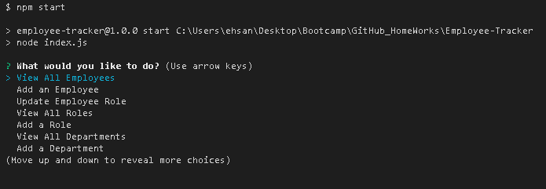
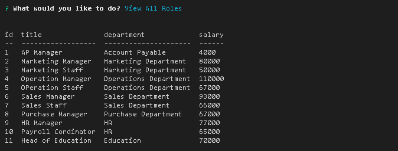
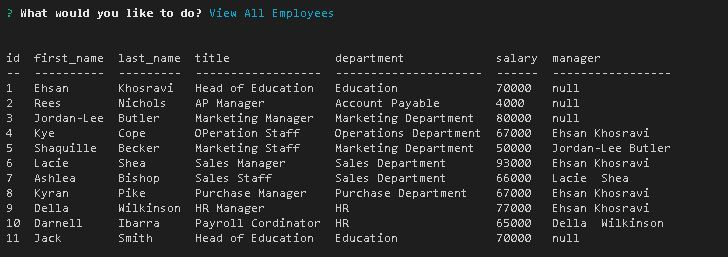

# Employee-Tracker

```md
This application manages a company's employee database, using Node.js, Inquirer, and MySQL
```

### Demo Video:

[Watch it Here](https://drive.google.com/file/d/1YtXnyFg90knvRS5GSwSM6MDXbKzxmlsi/view?usp=sharing)

```sh
 https://drive.google.com/file/d/1YtXnyFg90knvRS5GSwSM6MDXbKzxmlsi/view?usp=sharing
```

## User Story

```md
AS A business owner
I WANT to be able to view and manage the departments, roles, and employees in my company
SO THAT I can organize and plan my business
```

## Installation:

```md
- npm install inquirer
- npm install mysql2
- npm install console.table

Run : npm start
```

## Screenshots:







